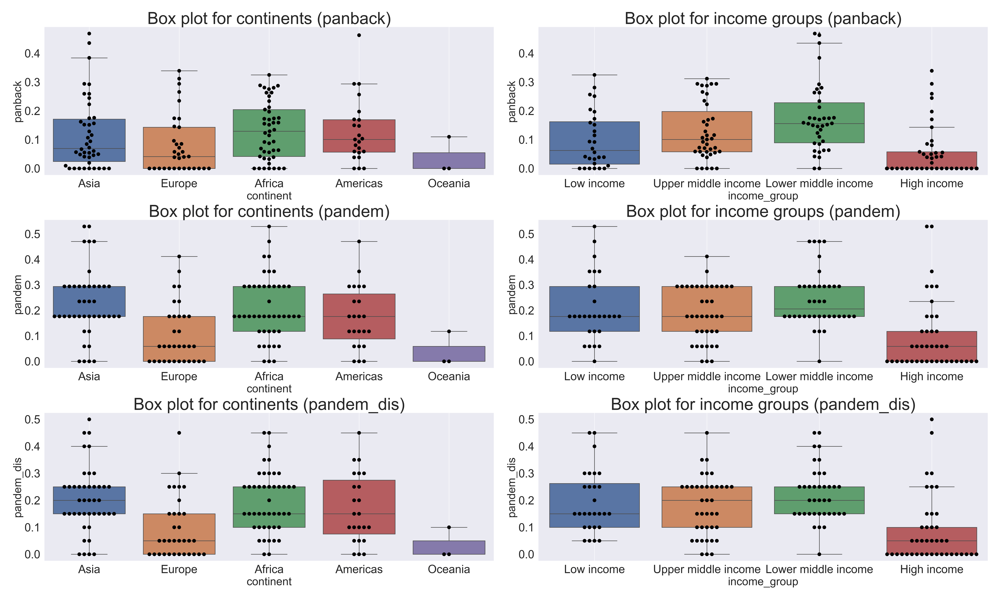

```{r setup, include=FALSE}
knitr::opts_chunk$set(echo = FALSE)
```


## Helicopter view

* project based on the **article** "Institutional Underpinnings and Democracy Backsliding in the Perspective of COVID-19" and the **poster** "A study of Democracy Backsliding in the Perspective of COVID-19 using econometrics and machine learning approaches" by PhD Jacek Lewkowicz, Michał Woźniak and Michał Wrzesiński
* **goal** of the article: investigating the drivers of the impact of the political decisions, as a response to the COVID-19 pandemic
* **materials**: use of a novel global dataset covering the period of the first wave of the pandemic (March-June 2020) 
* **methods**: various econometric and machine learning tools
* **conclusions**: rule of law and high level of the initial state of democracy prevent from democracy backsliding during the pandemic

## Goals of the reproducible project
* reproduction of the initial results
* improvement of the study by performing robustness checks
* structuring the project
* clean and readable code for reproducibility
* combination of the research methodology developed as a part of a scientific article and a poster from conference MLinPL

## Challenges
* updated dependent variables:
  - new methodology of calculating indexes
  - wider time horizon
* lack of reproducibility of the code (files sent by e-mails)
* econometric part of the study (diagnostic tests) performed initially in STATA
* mix of R and Python:
  - econometric part in **R**
  - creating databases and performing ML part in **Python**

## Research purpose
* COVID-19 and its economic and legal consequences are undoubtedly a very important problem that we have to face.
* Governments are using the global pandemic to pursue their opportunistic goals, corruption and power strengthening.
  - Therefore, **pandemic is concerned as a serious threat to democracy**, as governments may try to limit democratic rules under the cover of pandemic management.
  - On the other hand, well-managed lockdowns and other means of government interventionism may lead to increased satisfaction with democracy or trust in government.
* An alleged **democracy recession** can be **observed in recent years** and this **backsliding** is **deeply rooted in institutional environment**.
* The phenomenon of democracy backsliding remains unexplained despite many attempts.

## Research question {.bigger}
<br>
<br>
<br>

<span style="font-size:xx-large">What is the relevance of the law and the current state of democracy for susceptibility to democracy backsliding in the face of the COVID-19?</span>

## Materials {.smaller}

| Group of variables | Variables | Time range |
|:----|:------|:---:|
| Pandemic data | Pandemic Democratic Violations Index (*pandem*), Pandemic Democratic Violations Disinformation Index (*pandem_dis*), Pandemic Backsliding Index (*panback*)  | 03.2020 - 07.2020 |
| Democratization data  | Rule of law index (*rule*), Electoral democracy index (*polyarchy*), Education level index (*education*), Politico-geographic regions (*region_geo*) | 2019 |
| Economic & Demographic data  | Gini Index (*gini*), GDP pc (*gdp_pc*), Trade GDP (*trade_gdp*), Inflation rate (*inflation*),  Oil sale (*oil*), Minerals sale (*mineral*),Population Density (*density*), Income group (*income_group*) | mostly 2019 |
| Fractionalization data  | Ethnic (*ethnic_frac*), Linguistic (*ling_frac*) and Religious fractionalization (*relig_frac*) | 2002 |

## Box plots

{width=90%}


## Adjustments
* adding new variable (ratio of covid cases to the population)
* adding squared terms for *panback* regression
* robustness checks:
  - time periods (Q2, Q3 and Q4 of 2020)
  - collinearity (excluding variables that cause too much collinearity)
  - missing values (excluding variables with too much imputations)


## OLS regression
* specification with categorical variables
* specification without categorical variables
* robustness checks

## Initial results - OLS with categorical variables {.smaller}

````{=html}
```{r, echo=FALSE, results='asis'}
xfun::file_string('results/main_research/ols_regression/Table_1_edited.html')
```
````
## Initial results - OLS without categorical variables {.smaller}

````{=html}
```{r, echo=FALSE, results='asis'}
xfun::file_string('results/main_research/ols_regression/Table_2_edited.html')
```
````

## Reproduced results - OLS with categorical variables {.smaller}


````{=html}
<div style="width: 1400px; margin: 0 auto;">
```{r, echo=FALSE, results='asis'}
xfun::file_string('results/robustness_check/ols_regression/main_tables/Table_1_edited.html')
```
</div>
````
## Reproduced results - OLS without categorical variables {.smaller}


````{=html}
<div style="width: 1400px; margin: 0 auto;">
```{r, echo=FALSE, results='asis'}
xfun::file_string('results/robustness_check/ols_regression/main_tables/Table_2_edited.html')
```
</div>
````


## Robustness check - collinearity {.smaller}

<br>
<br>
<br>

````{=html}
<div style="width: 1400px; margin: 0 auto;">
```{r, echo=FALSE, results='asis'}

xfun::file_string('results/robustness_check/ols_regression/robustness_collinearity/Table_1_edited.html')
```
</div>
````


## Robustness check - collinearity {.smaller}
<br>
<br>
<br>

````{=html}
<div style="width: 1400px; margin: 0 auto;">
```{r, echo=FALSE, results='asis'}
xfun::file_string('results/robustness_check/ols_regression/robustness_collinearity/Table_2_edited.html')
```
</div>
````

## Robustness check - missings {.smaller}
<br>
<br>
<br>

````{=html}
<div style="width: 1400px; margin: 0 auto;">
```{r, echo=FALSE, results='asis'}
xfun::file_string('results/robustness_check/ols_regression/robustness_missings/Table_1_edited.html')
```
</div>
````

## Robustness check - missings {.smaller}
<br>
<br>
<br>

````{=html}
<div style="width: 1400px; margin: 0 auto;">
```{r, echo=FALSE, results='asis'}
xfun::file_string('results/robustness_check/ols_regression/robustness_missings/Table_2_edited.html')
```
</div>
````


## Random Forest
* SHAP summary plots
* Permutation importance
* Partial Dependence Plots (PDPs) (1 dimensional and 2 dimensional)
* Accumulated Local Effects (ALE) plots (1 dimensional and 2 dimensional)

## SHAP summary plots - panback

```{r, echo=FALSE, out.width = '50%'}

knitr::include_graphics(c("results/main_research/random_forest/summary_plot_of_panback.png", "results/robustness_check/random_forest/summary_plot_of_panback.png"))

```


## SHAP summary plots - pandem

```{r, echo=FALSE, out.width = '50%'}
knitr::include_graphics(c("results/main_research/random_forest/summary_plot_of_pandem_dis.png", "results/robustness_check/random_forest/summary_plot_of_pandem.png"))
```


## Permutation Importance - panback

```{r, echo=FALSE, out.width = '50%'}

knitr::include_graphics(c("results/main_research/random_forest/permutation_importance_plot_of_panback.png", "results/robustness_check/random_forest/permutation_importance_plot_of_panback.png"))

```


## Permutation Importance - pandem

```{r, echo=FALSE, out.width = '50%'}
knitr::include_graphics(c("results/main_research/random_forest/permutation_importance_plot_of_pandem_dis.png", "results/robustness_check/random_forest/permutation_importance_plot_of_pandem.png"))
```


## 1D PDP - panback vs polyarchy

```{r, echo=FALSE, out.width = '50%'}

knitr::include_graphics(c("results/main_research/random_forest/pdp_1d_panback_vs_polyarchy.png", "results/robustness_check/random_forest/pdp_1d_panback_vs_polyarchy.png"))

```


## 1D PDP - pandem vs polyarchy

```{r, echo=FALSE, out.width = '50%'}
knitr::include_graphics(c("results/main_research/random_forest/pdp_1d_pandem_dis_vs_polyarchy.png", "results/robustness_check/random_forest/pdp_1d_pandem_vs_polyarchy.png"))
```


## 2D PDP - panback vs polyarchy and rule

```{r, echo=FALSE, out.width = '50%'}

knitr::include_graphics(c("results/main_research/random_forest/pdp_2d_panback_vs_polyarchy_and_rule.png", "results/robustness_check/random_forest/pdp_2d_panback_vs_polyarchy_and_rule.png"))

```


## 2D PDP - pandem vs polyarchy and rule

```{r, echo=FALSE, out.width = '50%'}
knitr::include_graphics(c("results/main_research/random_forest/pdp_2d_pandem_dis_vs_polyarchy_and_rule.png", "results/robustness_check/random_forest/pdp_2d_pandem_vs_polyarchy_and_rule.png"))
```


## CatBoost
* SHAP summary plots
* Permutation importance
* Partial Dependence Plots (PDPs) (1 dimensional and 2 dimensional)
* Accumulated Local Effects (ALE) plots (1 dimensional and 2 dimensional)


## SHAP summary plots - panback

```{r, echo=FALSE, out.width = '50%'}

knitr::include_graphics(c("results/main_research/catboost/summary_plot_of_panback.png", "results/robustness_check/catboost/summary_plot_of_panback.png"))

```


## SHAP summary plots - pandem

```{r, echo=FALSE, out.width = '50%'}
knitr::include_graphics(c("results/main_research/catboost/summary_plot_of_pandem_dis.png", "results/robustness_check/catboost/summary_plot_of_pandem.png"))
```


## Permutation Importance - panback

```{r, echo=FALSE, out.width = '50%'}

knitr::include_graphics(c("results/main_research/catboost/permutation_importance_plot_of_panback.png", "results/robustness_check/catboost/permutation_importance_plot_of_panback.png"))

```


## Permutation Importance - pandem

```{r, echo=FALSE, out.width = '50%'}
knitr::include_graphics(c("results/main_research/catboost/permutation_importance_plot_of_pandem_dis.png", "results/robustness_check/catboost/permutation_importance_plot_of_pandem.png"))
```


## 1D PDP - panback vs polyarchy

```{r, echo=FALSE, out.width = '50%'}

knitr::include_graphics(c("results/main_research/catboost/pdp_1d_panback_vs_polyarchy.png", "results/robustness_check/catboost/pdp_1d_panback_vs_polyarchy.png"))

```


## 1D PDP - pandem vs polyarchy

```{r, echo=FALSE, out.width = '50%'}
knitr::include_graphics(c("results/main_research/catboost/pdp_1d_pandem_dis_vs_polyarchy.png", "results/robustness_check/catboost/pdp_1d_pandem_vs_polyarchy.png"))
```


## 2D PDP - panback vs polyarchy and rule

```{r, echo=FALSE, out.width = '50%'}

knitr::include_graphics(c("results/main_research/catboost/pdp_2d_panback_vs_polyarchy_and_rule.png", "results/robustness_check/catboost/pdp_2d_panback_vs_polyarchy_and_rule.png"))

```


## 2D PDP - pandem vs polyarchy and rule

```{r, echo=FALSE, out.width = '50%'}
knitr::include_graphics(c("results/main_research/catboost/pdp_2d_pandem_dis_vs_polyarchy_and_rule.png", "results/robustness_check/catboost/pdp_2d_pandem_vs_polyarchy_and_rule.png"))
```


## Conclusions

* We recreated the original results and updated them with the new data and the new methodology.

* We confirmed that the results are not distorted by several robustness checks.

* Results compared to the original study are analogous.

* Influence of law and state of democracy is exceptionally strong. The stronger the rule of law and the higher the level of democracy, the lower is the risk of democracy backsliding in the face of global pandemic.

* Our study provides other variables that are worth further investigation such as: GDP per capita, population density, trade as a share of GDP, economic inequality, mineral rents as a share of GDP and linguistic fractionalization.


## Backup - RF


## 1D ALE - panback vs polyarchy

```{r, echo=FALSE, out.width = '50%'}

knitr::include_graphics(c("results/main_research/random_forest/ale_1d_panback_vs_polyarchy.png", "results/robustness_check/random_forest/ale_1d_panback_vs_polyarchy.png"))

```


## 1D ALE - pandem vs polyarchy

```{r, echo=FALSE, out.width = '50%'}
knitr::include_graphics(c("results/main_research/random_forest/ale_1d_pandem_dis_vs_polyarchy.png", "results/robustness_check/random_forest/ale_1d_pandem_vs_polyarchy.png"))
```


## 2D ALE - panback vs polyarchy and rule

```{r, echo=FALSE, out.width = '50%'}

knitr::include_graphics(c("results/main_research/random_forest/ale_2d_panback_vs_polyarchy_and_rule.png", "results/robustness_check/random_forest/ale_2d_panback_vs_polyarchy_and_rule.png"))

```


## 2D ALE - pandem vs polyarchy and rule

```{r, echo=FALSE, out.width = '50%'}
knitr::include_graphics(c("results/main_research/random_forest/ale_2d_pandem_dis_vs_polyarchy_and_rule.png", "results/robustness_check/random_forest/ale_2d_pandem_vs_polyarchy_and_rule.png"))
```

## Backup - CatBoost


## 1D ALE - panback vs polyarchy

```{r, echo=FALSE, out.width = '50%'}

knitr::include_graphics(c("results/main_research/catboost/ale_1d_panback_vs_polyarchy.png", "results/robustness_check/catboost/ale_1d_panback_vs_polyarchy.png"))

```


## 1D ALE - pandem vs polyarchy

```{r, echo=FALSE, out.width = '50%'}
knitr::include_graphics(c("results/main_research/catboost/ale_1d_pandem_dis_vs_polyarchy.png", "results/robustness_check/catboost/ale_1d_pandem_vs_polyarchy.png"))
```


## 2D ALE - panback vs polyarchy and rule

```{r, echo=FALSE, out.width = '50%'}

knitr::include_graphics(c("results/main_research/catboost/ale_2d_panback_vs_polyarchy_and_rule.png", "results/robustness_check/catboost/ale_2d_panback_vs_polyarchy_and_rule.png"))

```


## 2D ALE - pandem vs polyarchy and rule

```{r, echo=FALSE, out.width = '50%'}
knitr::include_graphics(c("results/main_research/catboost/ale_2d_pandem_dis_vs_polyarchy_and_rule.png", "results/robustness_check/catboost/ale_2d_pandem_vs_polyarchy_and_rule.png"))
```


